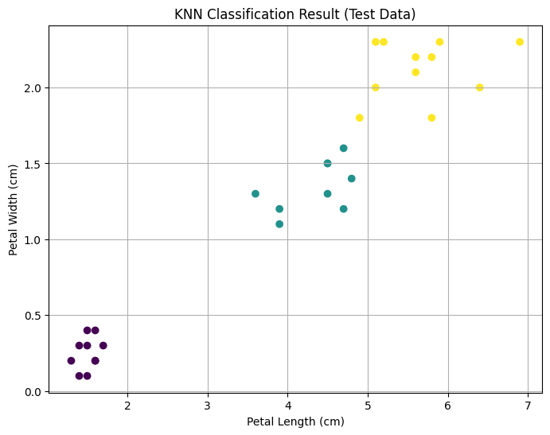

# 🌸 Task 01: Iris Flower Classification

Welcome to Task 1 of my Data Science internship at **Oasis Infobyte**, where I worked on a machine learning project to classify Iris flower species based on their morphological features.

---

## 📌 Objective

To build and evaluate machine learning models that can accurately classify **Iris flowers** into three species (*Setosa, Versicolor, Virginica*) based on features like:
- Sepal Length
- Sepal Width
- Petal Length
- Petal Width

---

## 🔍 Problem Statement

The Iris dataset is a well-known multiclass classification problem in machine learning. The goal is to train a supervised classification model that can predict the species of an iris flower given its measurements.

---

## 🛠️ Tools & Technologies Used

- **Python**
- **Jupyter Notebook**
- **Pandas** – data manipulation
- **NumPy** – numerical operations
- **Matplotlib & Seaborn** – data visualization
- **Scikit-learn** – ML models and evaluation

---

## 📊 Steps Performed

1. **Imported the dataset** (from `sklearn.datasets`)
2. **Exploratory Data Analysis (EDA)** using descriptive stats & plots
3. **Data visualization** with pair plots, heatmaps, histograms
4. **Model building** using:
   - Logistic Regression
   - K-Nearest Neighbors (KNN)
   - Decision Tree Classifier
5. **Train-Test Split** using `train_test_split`
6. **Model Evaluation** using:
   - Accuracy Score
   - Confusion Matrix
   - Classification Report

---

## ✅ Results

- Achieved **over 95% accuracy** using KNN models
- Clear species separation observed through visualization
- Models generalized well on unseen data

---

## 📸 Sample Output Visualizations

  
  
- Pairplot showing species separation  
- Confusion matrix of best-performing model

---

## 🔗 Important Links

- 🌐 [Oasis Infobyte Website](https://www.oasisinfobyte.com/)
- 📁 [GitHub Repository](https://github.com/Shruti-Chauhan01/OIBSIP/tree/main/OIBSIP_DS_01)
- 🔗 [LinkedIn Post](https://www.linkedin.com/in/shruti-chauhan-35b082338/)
- 📧 [Email Me](mailto:shrutihcauhan0086@gmail.com)

---

## 💡 What I Learned

- Hands-on application of ML classification techniques
- Importance of EDA in understanding data
- Visualizing performance and comparing multiple models
- Scikit-learn’s workflow for model training and evaluation

---

> *"Every flower is a soul blossoming in nature." — Gérard de Nerval*

---

**© 2025 | Shruti Chauhan**  
🔗 [GitHub](https://github.com/Shruti-Chauhan01) • [LinkedIn](https://www.linkedin.com/in/shruti-chauhan-35b082338/)

