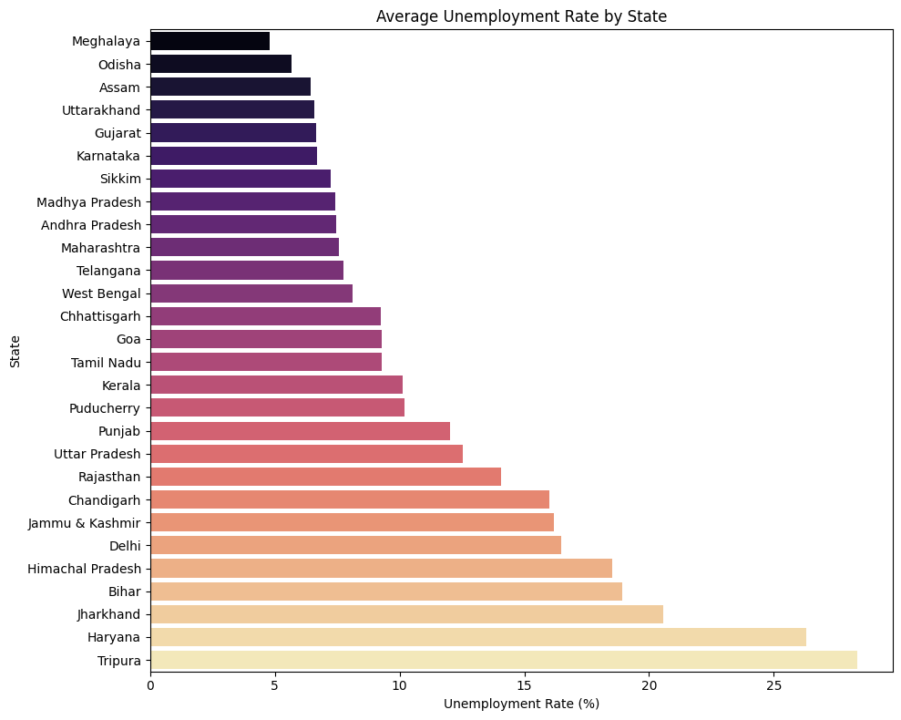
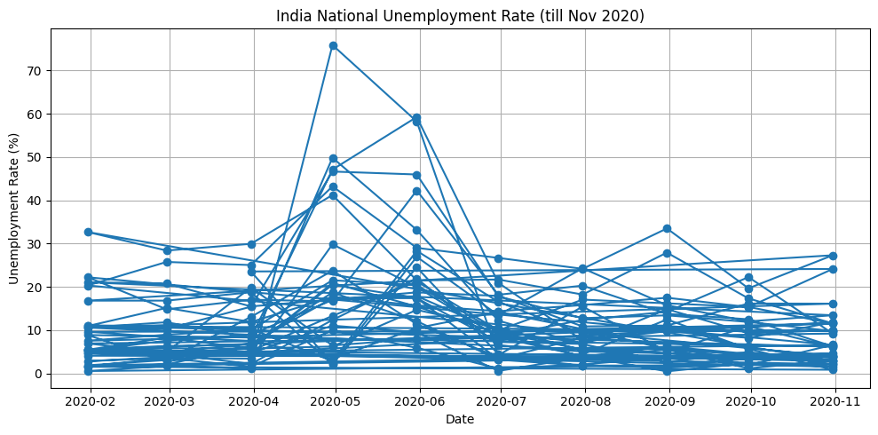

# 📉 Task 02: Unemployment Analysis with Python

This is Task 2 of my Data Science Internship under **Oasis Infobyte**, where I performed a comprehensive analysis of unemployment trends in India using real-world data. The goal was to identify key patterns and present insights through visualizations.

---

## 📌 Objective

To analyze the **unemployment rate** in India across different states, ages, and education levels using Python and derive meaningful insights by:
- Cleaning and processing real-world unemployment data
- Visualizing trends through impactful plots
- Highlighting the COVID-19 pandemic’s impact on employment

---

## 🔍 Problem Statement

Unemployment is one of the key indicators of economic health. This task involves exploring how unemployment varies with time, state, education, and demographic segments, especially around 2020–21 during the COVID-19 crisis.

---

## 🛠️ Tools & Technologies Used

- **Python**
- **Jupyter Notebook**
- **Pandas** – for data manipulation
- **NumPy** – for numerical operations
- **Matplotlib & Seaborn** – for data visualization
- **CSV Dataset** – Unemployment in India (from GitHub/Statistical Sources)

---

## 📊 Steps Performed

1. Loaded and examined the dataset structure  
2. Checked for missing values and cleaned the data  
3. Explored categorical variables like `Region`, `State`, and `Education`  
4. Visualized data through:
   - Bar charts and count plots
   - Line plots for unemployment trends over time
   - Heatmaps to show regional unemployment variation
5. Interpreted plots to identify insights and trends

---

## 📈 Results & Insights

- **Highest unemployment** was observed during mid-2020 due to COVID-19 lockdowns  
- **States like Haryana and Rajasthan** showed high unemployment rates  
- **Female unemployment** was consistently higher in rural areas  
- Trends were visualized effectively across time and demographics

---

## 📸 Sample Visualizations

 

- State-wise unemployment bar chart  
- Monthly unemployment trend line plot  
- Correlation heatmap of unemployment rates

---

## 🔗 Important Links

- 🌐 [Oasis Infobyte Website](https://www.oasisinfobyte.com/)
- 📁 [GitHub Repository](https://github.com/Shruti-Chauhan01/OIBSIP/tree/main/OIBSIP_DS_02)
- 🔗 [LinkedIn Post](https://www.linkedin.com/in/shruti-chauhan-35b082338/)
- 📧 [Email Me](mailto:shrutihcauhan0086@gmail.com)

---

## 💡 What I Learned

- Real-world data cleaning and feature understanding  
- Creating visually appealing plots using Seaborn  
- Interpreting data from multiple angles: geography, time, and gender  
- Enhancing storytelling with data

---

> *“Without data, you're just another person with an opinion.” – W. Edwards Deming*

---

**© 2025 | Shruti Chauhan**  
🔗 [GitHub](https://github.com/Shruti-Chauhan01) • [LinkedIn](https://www.linkedin.com/in/shruti-chauhan-35b082338/)

