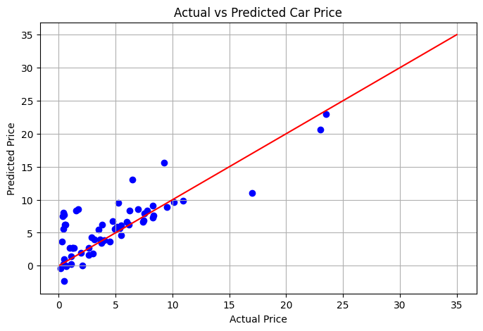

# 🚗 Task 03: Car Price Prediction using Linear Regression

This project is part of my Data Science internship at **Oasis Infobyte**, focused on building a machine learning model to predict the selling price of used cars based on various features.

---

## 📌 Objective

To develop a linear regression model that predicts the **selling price** of cars using attributes such as kilometers driven, fuel type, seller type, transmission, and others after encoding categorical variables.

---

## 🔍 Problem Statement

Predicting car prices helps buyers and sellers make informed decisions. Using a dataset of used cars, this project builds a regression model to estimate car prices accurately, evaluating the model's performance on unseen test data.

---

## 🛠️ Tools & Technologies Used

- **Python**  
- **Jupyter Notebook**  
- **Pandas** – data loading and preprocessing  
- **NumPy** – numerical operations  
- **Matplotlib & Seaborn** – visualization  
- **Scikit-learn** – model building and evaluation  

---

## 📊 Methodology

1. Loaded the dataset (`car data.csv`) and inspected the first few records  
2. Checked for null values and dataset information to ensure data quality  
3. Applied **one-hot encoding** (`pd.get_dummies`) to convert categorical features into numerical format  
4. Defined features (`X`) by dropping the target variable `Selling_Price`, which is the target (`y`)  
5. Split the data into training (80%) and testing sets (20%)  
6. Built and trained a **Linear Regression** model on the training data  
7. Predicted prices on the test set  
8. Evaluated model performance using:
   - **R² Score** (Coefficient of determination)  
   - **Mean Squared Error (MSE)**  
9. Visualized the relationship between actual and predicted prices with a scatter plot and a perfect prediction line

---

## 📈 Results

- **R² Score:** (Reflects the percentage of variance explained by the model; higher is better)  
- **Mean Squared Error:** (Lower values indicate better model accuracy)  
- The scatter plot between actual vs predicted prices shows how well the model fits the data, with points close to the red diagonal line indicating accurate predictions.

---

## 📸 Visualization

*Scatter plot showing actual car prices against predicted prices with a perfect prediction reference line.*

---

## 🔗 Important Links

- 🌐 [Oasis Infobyte Website](https://www.oasisinfobyte.com/)
- 📁 [GitHub Repository](https://github.com/Shruti-Chauhan01/OIBSIP/tree/main/OIBSIP_DS_03)
- 🔗 [LinkedIn Post](https://www.linkedin.com/in/shruti-chauhan-35b082338/)
- 📧 [Email Me](mailto:shrutihcauhan0086@gmail.com)

---

## 💡 Key Learnings

- Understanding the importance of preprocessing categorical variables for regression  
- Splitting data appropriately for training and testing  
- Evaluating regression models using R² and MSE  
- Visualizing model performance effectively to interpret results  

---

> *“Data is the new oil, and models are the engines that power insights.”*

---

**© 2025 | Shruti Chauhan**  
🔗 [GitHub](https://github.com/Shruti-Chauhan01) • [LinkedIn](https://www.linkedin.com/in/shruti-chauhan-35b082338/)
