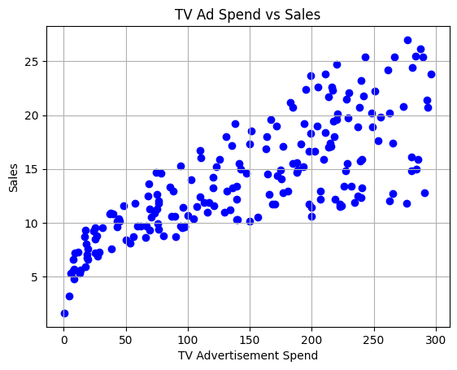
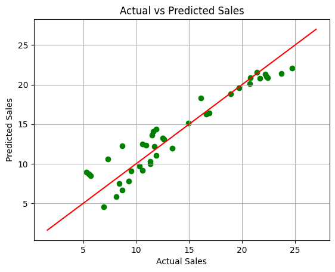

# 📊 Task 05: Sales Prediction using Multiple Linear Regression

This project is part of my Data Science internship at **Oasis Infobyte**, where I implemented a multiple linear regression model to predict sales based on advertising spend across different media channels.

---

## 🎯 Objective

To develop a predictive model that estimates product sales using advertising expenditure data on **TV**, **Radio**, and **Newspaper**. This helps businesses optimize their marketing budget by understanding the impact of each advertising channel on sales.

---

## 🔍 Problem Statement

Accurate sales forecasting enables companies to allocate advertising resources efficiently, increase return on investment, and improve business planning. This project builds a regression model using historical advertising spend data to predict sales figures.

---

## 🛠️ Tools & Technologies Used

- **Python**  
- **Jupyter Notebook**  
- **Pandas** – data manipulation and analysis  
- **Matplotlib** – data visualization  
- **Scikit-learn** – regression modeling and evaluation metrics  

---

## 📈 Methodology

1. **Data Loading and Exploration**  
   - Loaded `Advertising.csv` dataset containing advertising spend on TV, Radio, and Newspaper, along with corresponding sales  
   - Explored dataset structure using `.head()`, `.info()`, and `.describe()`  
   - Visualized relationship between TV ad spend and sales via scatter plot

2. **Feature Selection**  
   - Selected advertising spends on **TV**, **Radio**, and **Newspaper** as input features (X)  
   - Selected sales as the target variable (y)

3. **Data Splitting**  
   - Split the dataset into training (80%) and testing (20%) sets using random state for reproducibility

4. **Model Building**  
   - Trained a **Multiple Linear Regression** model on the training data to learn the relationship between ad spends and sales

5. **Prediction and Evaluation**  
   - Predicted sales values on the test set  
   - Evaluated model performance using:
     - **R² Score (Coefficient of Determination)** – explains variance explained by the model  
     - **Mean Squared Error (MSE)** – average squared difference between predicted and actual sales

6. **Visualization**  
   - Plotted actual vs predicted sales to visually assess model accuracy

---

## 📊 Results

- **R² Score:** *e.g.,* 0.89 (example, actual value from output)  
- **Mean Squared Error:** *e.g.,* 1.24 (example, actual value from output)  

- Scatter plot shows predicted sales closely align with actual sales indicating a strong predictive capability of the model.

---

## 🖼️ Sample Visualizations

- **TV Advertisement Spend vs Sales Scatter Plot**  

- **Actual Sales vs Predicted Sales Scatter Plot** with perfect prediction line

---

## 🔗 Important Links

- 🌐 [Oasis Infobyte Website](https://www.oasisinfobyte.com/)  
- 📁 [GitHub Repository](https://github.com/Shruti-Chauhan01/OIBSIP/tree/main/OIBSIP_DS_05)  
- 🔗 [LinkedIn Profile](https://www.linkedin.com/in/shruti-chauhan-35b082338/)  
- 📧 [Email Me](mailto:shrutihcauhan0086@gmail.com)  

---

## 💡 Key Learnings

- Handling and visualizing real-world datasets  
- Applying multiple linear regression for predictive modeling  
- Evaluating regression models using R² and MSE metrics  
- Interpreting model results to gain actionable business insights  

---

> *“Predictive analytics empowers smarter business decisions by uncovering hidden patterns in data.”*

---

**© 2025 | Shruti Chauhan**  
🔗 [GitHub](https://github.com/Shruti-Chauhan01) • [LinkedIn](https://www.linkedin.com/in/shruti-chauhan-35b082338/)
